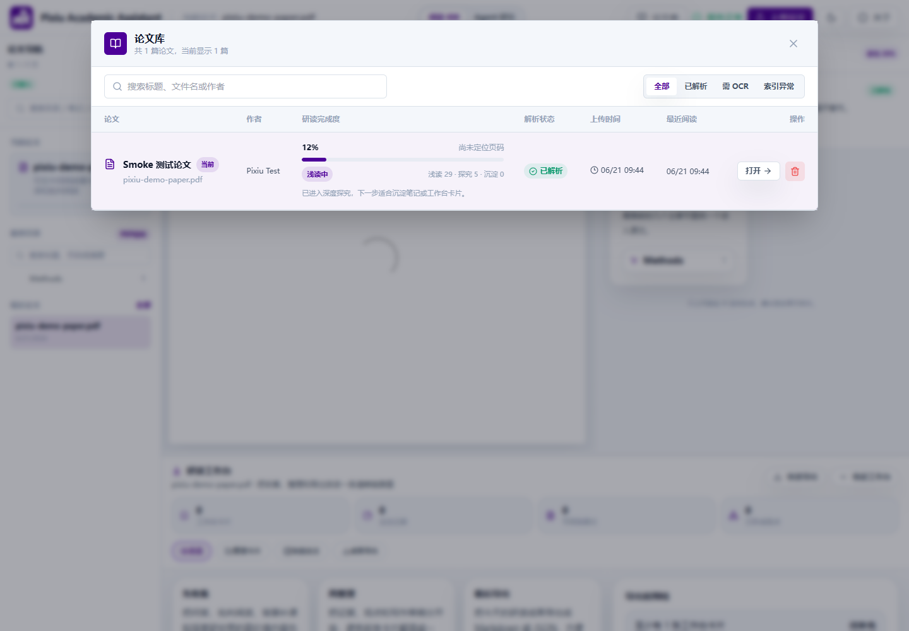
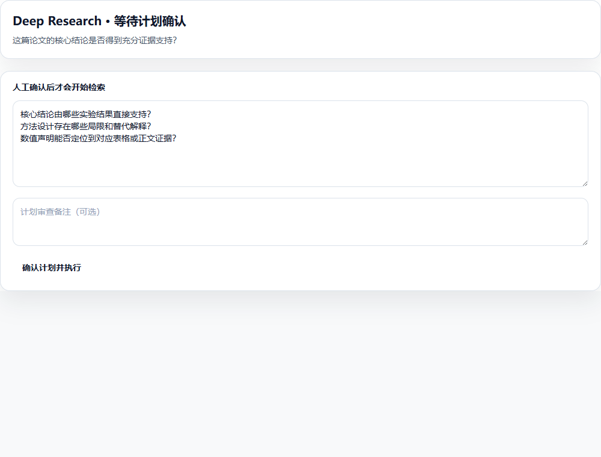
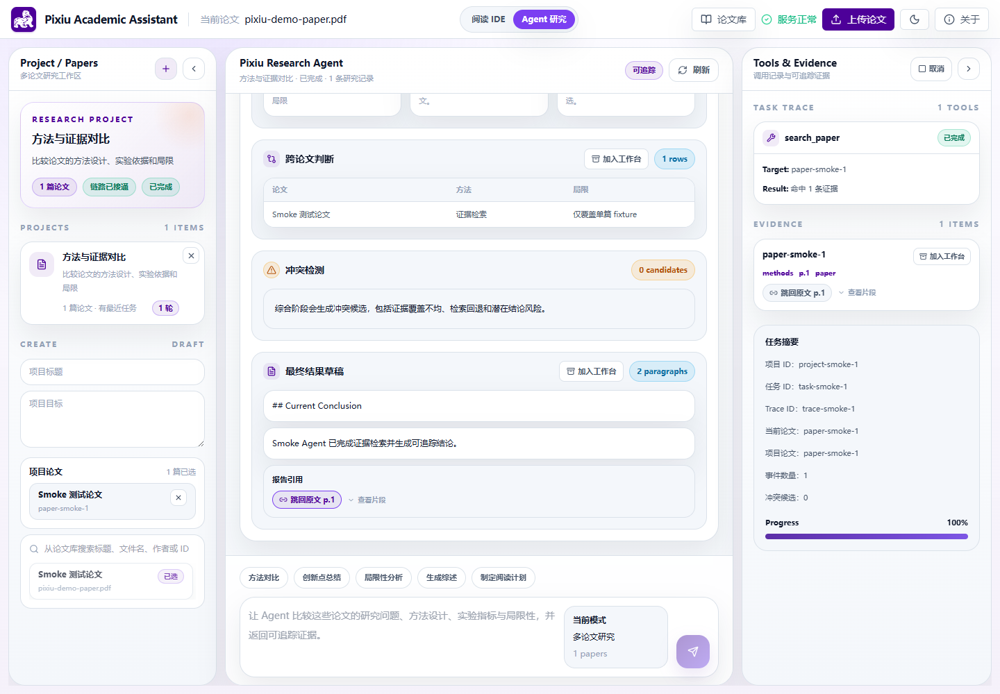

# Pixiu Academic Assistant 用户指南

本指南面向直接使用 Pixiu 阅读和研究论文的用户。你只需要获得一个可访问的 Pixiu 地址；部署、环境变量和开发命令请查看项目根目录的 `README.md`。

## 开始前检查

1. 在浏览器中打开 Pixiu，默认本地地址为 `http://localhost:5173`。
2. 查看顶部服务状态。显示“服务正常”后再上传或分析论文；显示“服务异常”时请联系系统维护者检查后端服务。
3. 准备带可复制文字层的 PDF。扫描件可以保留阅读，但问答、检索和分析能力会受限。

> Pixiu 的结论用于辅助阅读，不代替作者原文和人工判断。遇到冲突、缺失证据或数值候选时，应回到来源片段核对。

## 单论文阅读流程

### 1. 上传和重新打开论文

1. 保持顶部模式为“阅读 IDE”。
2. 点击上传区域并选择 PDF，等待文件名和解析状态出现。
3. 点击“论文库”查看已保存论文；选择“打开”可恢复 PDF、聊天、分析结果、笔记和工作台内容。
4. 如果论文显示“需 OCR”，请先用其他工具完成 OCR，或更换带文字层的 PDF；如果显示“索引异常”，正文仍可阅读，但依赖检索的功能可能不可用。

删除论文会同时删除其关联聊天、笔记和引导学习记录，确认前请先保存需要的内容。

### 2. 问答和划词解释

- 在“问答”面板输入与当前论文有关的问题。回答中的来源标签可用于查看片段；来源带页码时可以跳回 PDF。
- 在 PDF 中选中文字后使用“划词解释”，可继续围绕同一段文字追问。
- 回答没有可靠来源或来源不足时，应缩小问题范围，或直接查看原文，不要把模型回答当作论文事实。

### 3. 篇章解构

打开“功能导航”，选择“篇章解构”。系统会显示解析出的章节和论文骨架。章节摘要可以“加入工作台”，并保留章节信息。

篇章解构也是“引导学习”的前置步骤。扫描件或解析不完整的论文可能只显示空骨架或部分章节。

### 4. 逐页翻译

1. 在 PDF 阅读器中翻到需要处理的页面。
2. 从“功能导航”进入“逐页翻译”，生成当前页译文。
3. 切换页面后再次生成；成功的当前页译文可以“加入工作台”，并保留页码。
4. 显示“当前页没有可翻译的正文内容”时，该页通常主要是图片、表格、公式或扫描内容；显示超时时可以点击“重试翻译”。

### 5. 背景补课

1. 从“功能导航”进入“背景补课”。
2. 根据需要设置补课深浅、学习目标和当前卡点，然后生成图谱。
3. 查看概念、前置依赖、来源覆盖率和推断提示。

背景图谱只围绕当前论文生成。标记为“模型推断”的节点或关系不是论文中的直接结论，应结合来源和其他资料核对。

### 6. 引导学习

1. 先完成“篇章解构”。
2. 进入“引导学习”，说明当前阅读进度并开始学习。
3. 用自己的话回答每一轮问题；系统会给出掌握度、证据质量和回读建议。
4. 固定流程共 5 轮。需要重新开始时使用面板中的重置入口。

如果提示缺少论文结构，请返回“篇章解构”，确认当前论文已经成功解析。

### 7. 批判阅读

进入“批判阅读”并启动分析。结果包含作者主张、真实贡献、局限、夸大风险、缺失证据、数值证据候选和来源。

- `SUPPORTED`、候选表格或评分只表示系统找到相应线索，不等于结论已被严格证明。
- “暂无引用网络”表示系统没有真实引用图数据，不会用示例网络代替。
- 使用来源标签回到原文，重点核对夸大风险、缺失证据和数值声明。

## Deep Research：单论文深度研究

Deep Research 只围绕当前论文及系统允许的内部检索范围工作，不会默认联网搜索。

1. 从“功能导航”进入“深度研究”。
2. 填写研究目标，先生成 brief 预览，确认问题范围后创建任务。
3. 任务进入“等待计划确认”时，逐行检查、增删或修改研究子问题，必要时填写审查备注，然后点击“确认计划并执行”。未确认前不会开始检索。
4. 执行中可查看计划状态、finding、证据、JUDGE 分数、覆盖率、冲突和 trace；需要停止时点击“取消任务”。
5. 草稿生成后，任务进入“等待终稿确认”。逐项把冲突或缺证据风险标记为“已核查”或“仍需跟进”，填写备注后点击“确认终稿”。
6. 完成后查看报告和 trace 计数器。冲突区与“仍需跟进”项目必须继续人工核查。

刷新页面或重启服务后，已持久化任务可从当前论文的 latest 任务恢复。运行中的任务若被服务重启中断，可能显示失败或已过期，需要重新创建。

## Agent 研究：多论文对比与综合

### 1. 创建项目

1. 先在阅读 IDE 中把需要比较的论文逐篇上传到论文库。
2. 点击顶部“Agent 研究”。从阅读 IDE 的“推荐下一步”进入时，当前论文会默认加入新项目草稿。
3. 填写项目标题和目标，从论文库搜索并选择多篇论文，然后创建项目。
4. 可在左侧切换项目、调整挂载论文或删除项目。删除项目会同时移除其服务端任务和事件摘要。

### 2. 发起和审查任务

1. 在底部输入具体任务，例如“比较这些论文的研究问题、方法设计、实验指标与局限性”。
2. 点击“启动 Agent 任务”。每次提交都会形成当前项目下的一条独立研究记录。
3. 任务进入计划审查时，检查研究指令、focused papers 和约束，确认后才开始检索。
4. 查看时间线、工具调用、证据片段、跨论文对比表、冲突候选、开放问题和报告草稿。
5. 进入“终稿人工审查”后，逐项核查风险并确认终稿，任务才会标记为完成。

项目任务历史由服务端恢复；临时加载失败时，浏览器本地快照可作为降级显示。服务重启前仍在运行或排队的任务会恢复为失败，并说明中断原因；等待人工审查的任务可以继续审查。

### 3. 核对来源

- Agent 证据、冲突候选和报告引用与阅读 IDE 使用相同的来源标签。
- 来源有页码时，点击后会切换到对应论文并定位 PDF；无页码时只显示缓存片段，不会伪造跳转。
- 如果来源论文已从论文库删除，只能查看仍保留的片段信息。

### 4. 阅读 Agent 报告

Agent 任务完成后生成的报告包含以下结构化章节。报告以 Markdown 渲染，各章节左侧有彩色左边框标识：

**Executive Summary（执行摘要）**
报告开头的 2-3 句概述，总结研究问题、涉及论文数、证据总量、关键发现和待解决冲突。当 LLM 不可用时，会自动生成确定性摘要。

**Consensus Findings（共识发现）**
由 ≥ 2 篇论文共同支持的发现。每条附平均可信度评分和置信度标识：
- 绿色徽标 "高置信度"：平均可信度 ≥ 0.75
- 橙色徽标 "中等置信度"：平均可信度 ≥ 0.50
- 灰色徽标 "低置信度"：< 0.50
- 章节左边框为绿色实线。

**Contested Findings（争议发现）**
存在冲突的发现。分为两类：
- `auto_resolved`：系统自动判定，显示裁决方向
- `needs_manual_review`：需人工核查，附带裁决受阻原因
- 章节左边框为橙色实线。

**Single-Source Findings（单源发现）**
仅由一篇论文证据支持的发现，明确标注"视为低置信度"。还包含证据稀疏或仅 fallback 检索的论文说明。章节左边框为灰色实线。

**置信度徽标颜色速查**

| 级别 | 圆点颜色 | 背景 | 含义 |
|---|---|---|---|
| high | 绿色 `#16a34a` | 浅绿 | 多源强证据支持 |
| medium | 琥珀色 `#ca8a04` | 浅琥珀 | 证据有一定支撑力 |
| low | 橙色 `#d97706` | 浅橙 | 证据较弱，需谨慎采信 |
| insufficient | 灰色 `#6b7280` | 浅灰 | 当前证据不足以支撑结论 |

> 置信度评分由来源类型信任度、页码锚定、跨来源一致性和 JUDGE 评分四维加权计算。任何置信度级别的发现都可能出错，用于论文写作或研究决策前请回到原始证据片段核对。

### 5. 分享报告

Agent 任务完成后，可对报告生成只读分享链接：

1. 在完成的任务面板中点击分享操作。
2. 系统生成一个有时效的只读分享链接（7 天有效期）。
3. 打开链接的用户只能看到报告的 Markdown 正文和项目标题，无法访问 PDF 原文、聊天历史、工作台内容或 API 配置。
4. 过期或无效链接会提示"分享链接不存在或已过期"。

## 保存到研读工作台

以下内容可以“加入工作台”：

- 对话、批判阅读和背景补课结果；
- 当前页译文和单章节篇章解构摘要；
- Deep Research findings；
- Agent 报告草稿、跨论文对比表和单条证据。

点击底部“展开工作台”查看长期保存的 cards/notes。保存内容会保留适用的论文、页码、章节、来源、项目或任务标识。

Agent 报告和对比表需要先在阅读 IDE 打开一篇当前论文，才能确定工作台归属；按钮禁用并提示“请先在阅读 IDE 打开一篇论文”时，先切回阅读 IDE 打开目标论文。Agent 证据卡仍保留自身来源论文信息。

## 常见问题

| 提示或现象 | 处理方式 |
| --- | --- |
| 顶部显示“服务异常”或提示无法连接后端 | 确认网络正常；本地使用时请维护者检查 Docker、Java 网关和 Python 服务。 |
| 上传失败 | 确认文件是有效 PDF，后端服务正常，然后重试。 |
| 论文显示“需 OCR” | 对扫描件执行 OCR，或换用带文字层的 PDF；正文问答、分析和检索可能受限。 |
| 论文显示“索引异常” | 可以继续阅读 PDF，但检索型功能可能失败；请维护者重新建立索引。 |
| 当前页无可翻译正文 | 页面可能主要由图片、表格、公式或扫描内容组成；换页或先 OCR。 |
| 翻译超时或失败 | 使用“重试翻译”；持续失败时检查 AI 服务和模型配置。 |
| 引导学习提示缺少论文结构 | 先完成“篇章解构”，并确认论文不是无法解析的扫描件。 |
| Deep Research 或 Agent 长时间不推进 | 刷新任务状态；查看是否正在等待计划或终稿人工确认。 |
| 任务显示失败、已过期或被服务重启中断 | 已生成内容仍可查看时先保存；运行任务通常需要重新创建。 |
| Agent 产物无法加入工作台 | 先切回阅读 IDE 打开一篇论文，再返回 Agent 保存。 |
| 来源标签不能跳转 PDF | 来源可能没有页码、论文已删除或旧缓存字段不完整；改为查看片段详情。 |
| 报告出现冲突或“仍需跟进” | 回到来源逐条核查，不要直接把草稿作为最终结论。 |

## 使用边界与隐私

- 系统不会在界面中展示 API key、完整内部 prompt 或原始敏感 trace。
- Deep Research 和 Agent 当前以论文及内部文献库为主要范围，不默认使用外部 Web 搜索。
- 关闭或清理浏览器数据可能影响仅保存在 IndexedDB 中的本地阅读状态；服务端任务恢复能力以当前部署配置为准。
- AI 生成的翻译、解释、评分、冲突和报告都可能出错。用于论文写作或研究决策前，请回到原文验证并按规范引用。
