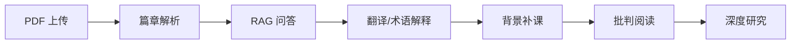
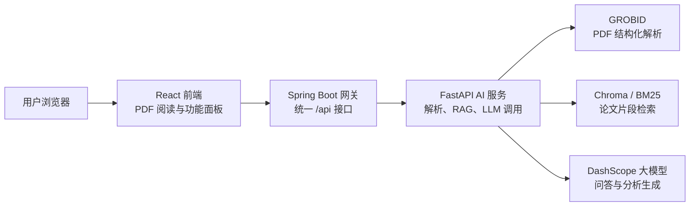
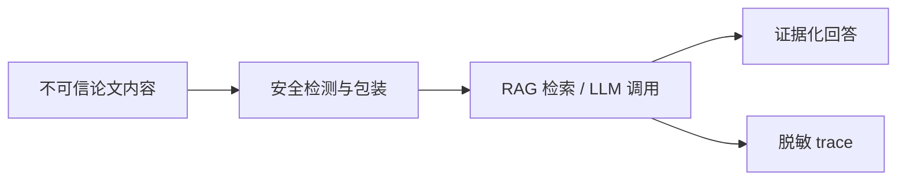

# Pixiu Academic Assistant 中期答辩 PPT 分页版

> 用途：按 PPT 页组织的答辩文档，可直接作为制作幻灯片的分镜稿。  
> 建议时长：5 分钟左右。  
> 建议页数：14 页正文 + 2 页附录。  
> 分页标记：每页之间使用 `<!-- pagebreak -->`，复制到支持分页的 Markdown/Word 工具时可作为分页依据。

<!-- pagebreak -->

## 第 1 页：封面

### 页面标题

学术论文 AI 助手（Pixiu Academic Assistant）中期答辩

### 页面内容

- 项目名称：学术论文 AI 助手（Pixiu Academic Assistant）
- 项目类型：大学生创新训练计划项目
- 项目负责人：待填写
- 项目成员：待填写
- 指导老师：待填写
- 答辩时间：2026 年 5 月

### 讲稿提示

各位老师好，我们的项目是 Pixiu Academic Assistant，中文名称为“学术论文 AI 助手”。项目面向学术论文阅读、理解和批判性分析场景，目标是构建一个集 PDF 阅读、论文解析、RAG 问答、术语解释、逐页翻译、批判性阅读、背景补课和深度研究于一体的 AI 辅助平台。

### 素材建议

- 项目 Logo 或系统首页截图
- 团队信息与答辩日期

<!-- pagebreak -->

## 第 2 页：研究背景与问题

### 页面标题

论文阅读中的痛点

### 页面内容

- 英文论文阅读门槛高，术语、公式、方法和实验细节理解成本高
- 普通大模型容易脱离论文原文回答，存在幻觉风险
- 学生需要的不只是翻译，还需要结构化摘要、证据化问答和批判性分析
- 阅读过程中缺少“前置知识补课”和“主动理解检查”的工具

### 讲稿提示

传统 PDF 阅读器主要解决“看论文”的问题，而通用聊天机器人虽然可以回答问题，但不一定能稳定依据当前论文。我们的目标是把论文原文、检索证据、知识补课和交互式学习流程结合起来，帮助用户从“读懂一篇论文”进一步走向“评价一篇论文”。

### 素材建议

- 痛点流程图：上传论文 -> 看不懂术语 -> 不确定贡献 -> 难以批判分析
- 对比表：普通 PDF 阅读器 / 通用 AI / Pixiu

<!-- pagebreak -->

## 第 3 页：项目目标与定位

### 页面标题

面向论文阅读的 AI 学习工作台

### 页面内容

- 输入：用户上传的学术论文 PDF
- 核心能力：解析论文结构、提取证据、回答问题、辅助翻译、生成分析
- 输出：结构化摘要、术语解释、RAG 问答、批判性阅读报告、知识图谱、深度研究报告
- 使用场景：课程论文阅读、科研入门、文献汇报准备、论文方法理解

### 讲稿提示

Pixiu 不是单一问答工具，而是围绕论文阅读全流程设计的学习工作台。用户可以先查看论文结构，再基于论文证据提问，遇到知识缺口时进行背景补课，最后形成批判性分析和进一步研究问题。

### 素材建议

<!-- pagebreak -->

## 第 4 页：总体架构

### 页面标题

React + Spring Boot + FastAPI 的三层架构

### 页面内容

### 页面内容补充

- 前端：React 19 + Vite + Tailwind CSS，负责 PDF 阅读器和多功能面板
- Java 网关：Spring Boot 3.4 + Java 21，统一对外 API，转发 Python 服务
- AI 服务：FastAPI + GROBID + DashScope + RAG，负责核心智能能力
- 部署：Docker Compose 编排 frontend、backend、ai-service、grobid

### 讲稿提示

项目采用三层架构，把用户交互、接口网关和 AI 能力解耦。前端不用直接感知 Python 内部复杂逻辑；Java 统一维护 `/api` 契约；Python 专注论文解析、检索、模型调用和安全控制。

### 素材建议

- 系统架构图
- `docker-compose.yml` 服务编排截图

<!-- pagebreak -->

## 第 5 页：基础功能展示

### 页面标题

从 PDF 上传到论文解析

### 页面内容

- PDF 上传与预览
- GROBID 解析论文标题、摘要、章节和正文片段
- 前端显示论文结构和基础分析结果
- 论文内容被索引为 RAG 检索片段，供后续问答和分析复用

### 对应代码/模块

- 前端：`frontend/src/components/PdfViewer.jsx`
- 前端：`frontend/src/components/PaperAnalysis.jsx`
- Java：`POST /api/upload`
- Python：`POST /api/analyze-pdf`
- Python：`ai-service-python/services/analysis_service.py`

### 讲稿提示

这一页展示论文进入系统后的基础流程。PDF 上传后，系统不只是保存文件，而是把论文转成后续可检索、可问答、可分析的结构化材料。

### 素材建议

- 上传 PDF 的界面截图
- 论文解析结果截图

<!-- pagebreak -->

## 第 6 页：RAG 问答与术语解释

### 页面标题

基于当前论文证据的问答

### 页面内容

- 聊天面板支持围绕当前论文提问
- 划词术语解释结合页面上下文和论文片段
- 轻量 Agentic RAG：意图识别 -> 查询规划 -> 当前论文优先检索 -> 证据判断 -> 回答生成
- 返回 `rag_sources`，便于后续追溯回答依据

### 对应代码/模块

- 前端：`frontend/src/components/ChatPanel.jsx`
- Java：`POST /api/chat`，`POST /api/explain`
- Python：`ai-service-python/services/chat_service.py`
- Python：`ai-service-python/services/query_service.py`
- Python：`ai-service-python/services/retrieval_judge_service.py`

### 讲稿提示

本项目强调“基于当前论文回答”，而不是泛泛聊天。系统会优先检索当前论文片段，并在证据不足时显式提示，减少把模型猜测当作论文结论的问题。

### 素材建议

- 问答界面截图
- `rag_sources` 来源片段展示截图
- RAG 流程图

<!-- pagebreak -->

## 第 7 页：逐页翻译与阅读辅助

### 页面标题

面向论文页面的翻译体验

### 页面内容

- 按当前 PDF 页提取可翻译文本
- 结合论文骨架和页面上下文生成中文译文
- 翻页时自动更新译文
- 对已翻译页面进行缓存，避免重复请求
- 图片、图表和表格区域不在译文面板中重复展示

### 对应代码/模块

- 前端：`frontend/src/components/TranslationPanel.jsx`
- 前端：`frontend/src/utils/pdfTranslationLayout.js`
- Java：`POST /api/translate-page`
- Python：`ai-service-python/services/page_translation_service.py`

### 讲稿提示

翻译功能不是简单整篇复制翻译，而是围绕 PDF 当前页进行阅读辅助。用户在阅读英文论文时，可以保持页面和译文同步，减少上下文切换。

### 素材建议

- PDF 左侧阅读 + 右侧译文面板截图

<!-- pagebreak -->

## 第 8 页：批判性阅读

### 页面标题

证据化分析论文贡献与局限

### 页面内容

- 围绕贡献、方法、实验、局限四个维度分析论文
- 输出 evidence-based contributions、weaknesses、overclaim risks、missing evidence
- 证据不足时明确标记，不编造实验或结论
- 让用户从“论文讲了什么”进一步看到“论文哪些判断有证据支撑”

### 对应代码/模块

- 前端：`frontend/src/components/CriticalAnalysisPanel.jsx`
- Java：`POST /api/critical-reading/{pdfId}`
- Python：`ai-service-python/services/analysis_service.py`
- Python：`ai-service-python/services/evidence_service.py`

### 讲稿提示

批判性阅读是项目区别于普通 PDF 阅读器和一般问答工具的重要部分。它不是简单总结论文，而是围绕贡献、方法、实验和局限做证据化分析，并在证据不足时明确说明，降低模型编造结论的风险。

### 素材建议

- 批判性阅读结果截图
- 贡献、局限、证据不足等结构化字段截图

<!-- pagebreak -->

## 第 9 页：背景补课

### 页面标题

补齐论文理解所需的前置知识

### 页面内容

- 按“入门 / 一般 / 进阶”生成前置知识
- 输出概念图谱、学习路径和补课清单
- 学习路径按基础概念、方法前置、实验理解、批判视角组织
- 每个概念节点尽量绑定本次响应中的 `rag_sources`

### 对应代码/模块

- 前端：`frontend/src/components/BackgroundKnowledgePanel.jsx`
- Java：`POST /api/background-knowledge`
- Python：`ai-service-python/services/background_knowledge_service.py`
- 可选增强：Neo4j 知识图谱持久化预留

### 讲稿提示

背景补课面向“论文能看见，但前置知识不够”的场景。系统会根据论文主题和用户知识水平生成概念图谱与学习路径，帮助用户先补齐方法、实验和批判理解所需的基础概念。

### 素材建议

- 背景知识图谱截图
- 三档知识水平切换截图

<!-- pagebreak -->

## 第 10 页：引导式学习

### 页面标题

用苏格拉底式提问检查理解

### 页面内容

- 固定 5 轮问题：研究问题、方法创新、方法逻辑、实验依据、局限改进
- 根据用户回答给出掌握度、提示和回读建议
- 优先参考当前论文 RAG 证据
- 完成后给出最终总结和建议回读章节

### 对应代码/模块

- 前端：`frontend/src/components/SocraticQuestionsPanel.jsx`
- Java：`POST /api/socratic-session/start`，`POST /api/socratic-session/answer`
- Python：`ai-service-python/services/chat_service.py`
- Python：当前论文 RAG 证据优先

### 讲稿提示

引导式学习解决的是“我以为自己看懂了，但其实没有真正掌握”的问题。系统通过固定 5 轮递进问题，帮助用户围绕论文问题、方法、实验和局限进行主动回忆，并根据回答给出反馈和回读建议。

### 素材建议

- 苏格拉底式问答截图
- 掌握度评估和回读建议截图

<!-- pagebreak -->

## 第 11 页：深度研究

### 页面标题

把开放研究问题拆成可执行任务

### 页面内容

- 用户输入研究问题
- 系统拆成 3-5 个子问题
- 调度当前论文检索、文献库检索、证据判断和报告综合
- 支持任务创建、轮询查看、取消和结构化报告展示
- 当前任务状态保存在 Python 服务内存中，后续可扩展持久化

### 对应代码/模块

- 前端：`frontend/src/components/DeepResearchPanel.jsx`
- Java：`POST /api/research-tasks`
- Java：`GET /api/research-tasks/{taskId}`
- Java：`POST /api/research-tasks/{taskId}/cancel`
- Python：`ai-service-python/services/research_task_service.py`
- Python：`ai-service-python/services/tool_registry.py`

### 讲稿提示

深度研究面向更开放的论文分析或选题准备场景。它会把用户的问题拆成多个子问题，围绕当前论文和内部文献库检索证据，再综合为结构化 findings 和最终 Markdown 报告。

### 素材建议

- 深度研究任务状态截图
- 任务进度与最终报告截图

<!-- pagebreak -->

## 第 12 页：安全边界与工程可靠性

### 页面标题

不可信论文内容下的安全设计

### 页面内容

- 论文正文、页面上下文、RAG 片段统一视为不可信输入
- 对“忽略之前指令”“泄露 API Key”“执行命令”“联网搜索”等注入内容进行检测和包装
- Deep research 限制为当前论文和内部文献库，不自动扩展外部 Web 搜索
- Trace 只记录阶段状态、耗时、检索次数和截断摘要，不记录 API Key、完整 prompt 或完整论文全文
- 接口契约集中记录在 `docs/CONSTRAINTS.md`

### 对应代码/模块

- Python：`ai-service-python/services/safety_service.py`
- Python：`ai-service-python/services/trace_service.py`
- Python：`ai-service-python/services/tool_registry.py`
- 文档：`docs/CONSTRAINTS.md`
- 文档：`docs/MCP_ADAPTER_PLAN.md`

### 讲稿提示

AI 论文阅读工具会直接接触用户上传论文，而论文文本本身可能包含干扰模型的内容。因此项目在中期阶段已经开始建立安全边界：论文只作为资料，不作为系统指令。

### 素材建议

<!-- pagebreak -->

## 第 13 页：中期成果总结

### 页面标题

当前完成情况

### 页面内容

已完成：

- 三层架构搭建：React 前端、Spring Boot 网关、FastAPI AI 服务
- PDF 上传、预览、解析和论文结构化
- 基于当前论文的 RAG 问答与术语解释
- 逐页翻译和页面翻译缓存
- 批判性阅读、背景补课、苏格拉底式学习
- 深度研究任务：创建、轮询、取消、结构化报告
- 内部工具注册层、提示注入防护、trace 观测
- Docker Compose 本地编排和文档整理

已形成材料：

- 执行计划书草稿
- 周进展报告
- 中期检查表
- 开发约束文档
- MCP 适配预研文档

### 讲稿提示

中期阶段已经完成可演示原型，不只是界面展示；前端、后端、AI 服务和文档都已经形成闭环。答辩时可以重点展示“上传论文后，一路完成阅读、问答、分析和研究问题拆解”的完整流程。

### 素材建议

- 功能完成度矩阵
- 中期材料文件截图

<!-- pagebreak -->

## 第 14 页：存在问题与后续计划

### 页面标题

下一阶段工作

### 页面内容

当前问题：

- PDF 解析仍受论文版式影响，复杂公式、表格、多栏排版需要继续优化
- RAG 来源片段与回答之间的绑定还需要更稳定地展示给用户
- 深度研究任务状态目前主要保存在 Python 进程内存中，服务重启后不可恢复
- 前端多个功能面板已成型，但跨面板协同体验仍需打磨
- 测试覆盖需要继续补充，特别是跨服务联调和长任务稳定性测试

后续计划：

- 优化 GROBID 解析后的文本清洗、分块和版面过滤
- 强化证据引用、证据质量判断和回答可追溯性
- 完善提示注入防护、上下文裁剪和 trace 脱敏策略
- 优化前端阅读、翻译、问答、背景知识、批判阅读和深度研究之间的工作流
- 补充前端、Java、Python 自动化测试和演示用例
- 整理部署手册、用户说明、项目总结和结题答辩材料

### 讲稿提示

下一阶段重点不是“再堆功能”，而是让现有功能更稳定、更可信、更适合真实论文阅读场景。最终目标是形成一个可运行、可演示、可复用的学术论文 AI 辅助阅读平台原型。

### 素材建议

<!-- pagebreak -->

## 附录 A：5 分钟答辩节奏

### 页面标题

答辩时间分配

### 页面内容

| 时间 | 内容 |
| --- | --- |
| 0:00-0:30 | 项目背景与痛点 |
| 0:30-1:00 | 项目目标和整体架构 |
| 1:00-2:20 | 基础功能：上传、解析、RAG 问答、逐页翻译 |
| 2:20-3:40 | 核心亮点：批判阅读、背景补课、苏格拉底学习、深度研究 |
| 3:40-4:20 | 安全边界、trace、工程实现 |
| 4:20-5:00 | 中期成果、问题和下一阶段计划 |

### 使用说明

这一页可以不放入正式 PPT，也可以作为答辩排练页使用。

<!-- pagebreak -->

## 附录 B：现场演示优先级

### 页面标题

演示顺序与备用方案

### 页面内容

如果答辩现场只能演示 2-3 个功能，建议优先展示：

1. **PDF 上传 + 论文解析**：证明系统完整跑通。
2. **RAG 问答 / 划词解释**：证明回答基于当前论文上下文。
3. **批判性阅读或深度研究**：体现区别于普通 PDF 阅读器和通用聊天机器人的核心创新。

如果网络或模型接口不稳定，提前准备：

- 系统运行截图
- 关键功能录屏
- 一篇固定示例论文
- 一组固定问答和分析结果

### 使用说明

这一页主要用于答辩准备和现场兜底，不一定放入正式汇报 PPT。
